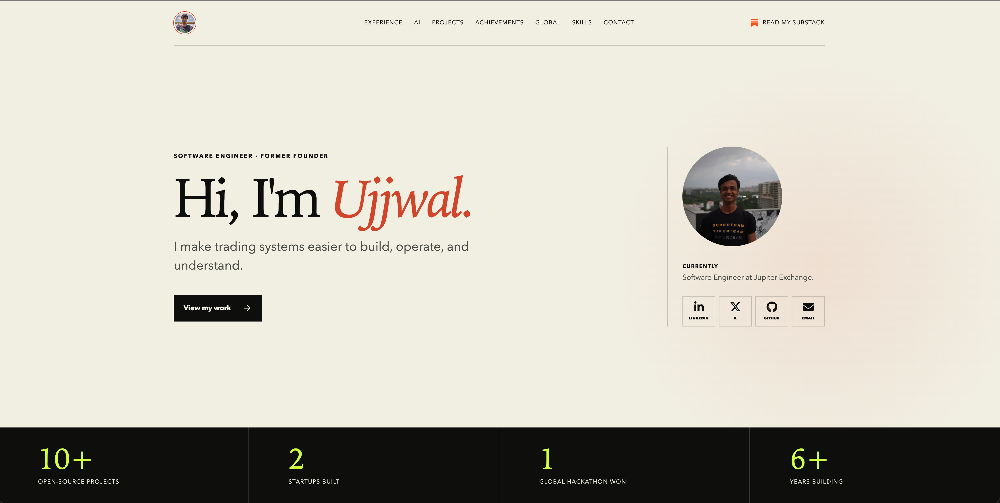

## Work by [Ujjwal Gupta](https://twitter.com/ujjwalgupta49)  (ujjwal49.xyz)

open source contributions:
[solana-base-app](https://github.com/UjjwalGupta49/solana-base-app) 
solana-base-app is a dapp scaffold, including most of the common features  
such as wallet-adapter, token balance, airdrops, transaction, **solana-pay**. 
solana-base-app helps new developers onboard to the solana ecosystem with minimum resistance and provides vetran galss-eaters a sandbox with modular react components to build upon.  
try using `npx solana-base-app react my-app`
> solana-base-app was featured at [soldev.app](https://soldev.app/library/scaffolds) and has helped 300+ developers with their solana journey. ✨
